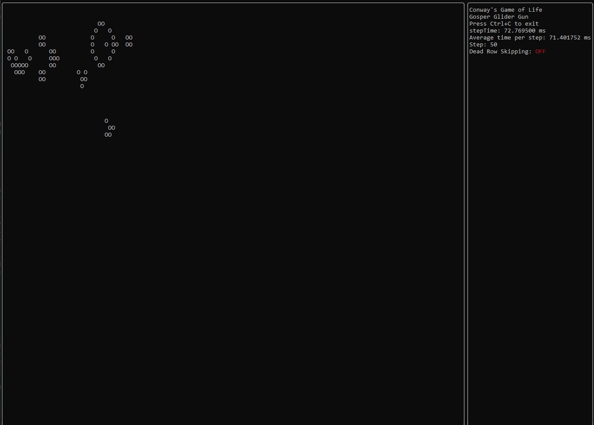
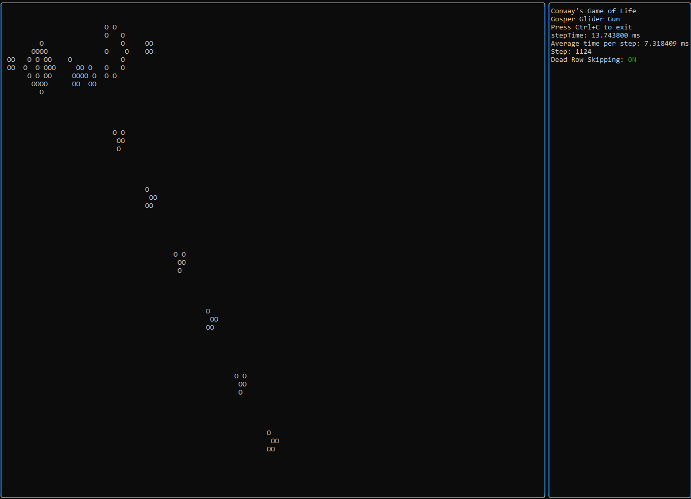

# Terminal Automaton
Conway's Game of Life in your terminal!

## Dependencies
- ftxui for terminal rendering

## Optimizations
- BitBoards: By storing the values of each cell as a bit in a unsigned int instead of a bool, I am able to use one bit per cell instead of one byte. This brings down the memory usage to roughly 8 times less.
- Dead row / collumn skipping: By checking if a row / collumns and its neighbours dont have any active cells, I can save computational power by only computing the cells in active rows / collumns.
- ftxui grid cutting: By checking the size of the terminal I only tell ftxui to render the grid that is visible, which cuts down rendering times considerably.

  ### Comparison - Gosper glider gun in a 1024 x 1024 grid
  
  
  Since the grid conatins mostly empty cells, the performance is boosted heavily by turning on dead row / collumn skipping.

## TODO
- [ ] Implement a method for the user to change starting conditions
